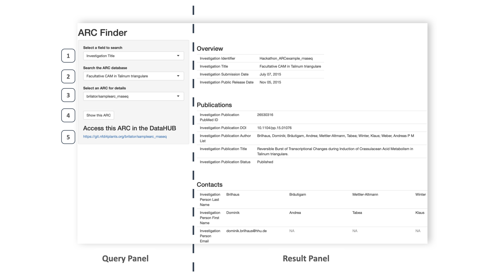

---
title: "ARC-Finder &ndash; A simple, locally-deployed tool to find your peer's research data"
author: [Dominik Brilhaus, <https://orcid.org/0000-0001-9021-3197>]
date: "2022-06-09"
keywords: [Metadata, ARC, DataPLANT]
subtitle: "Projektmodul (Modul 9) des Zertifikatskurs FDM (15.07) 2021 / 2022"
lang: "en"
toc: true
toc-own-page: true
footer-left: "Dominik Brilhaus"
footer-center: \href{http://creativecommons.org/licenses/by/4.0/}{\includegraphics[width=30mm,scale=0.5]{cc-by4.png}}
titlepage: true
titlepage-color: "2D3E50"
titlepage-text-color: "FFC000"
titlepage-rule-color: "FFC000"
titlepage-rule-height: 2
header-includes:

- \usepackage{longtable, array, booktabs}
...

<!-- quickfix: For some weird reason the latex packages now have to be loaded first, when using a latex table with the eisvogel template. -->
<!-- used to work just fine without yesterday....  -->
<!-- pandoc template from: https://github.com/Wandmalfarbe/pandoc-latex-template -->
<!-- pandoc project.md -o project.pdf --from markdown --template eisvogel --listings -->

# Introduction

## Motivation

Research is a highly collaborative endeavor that builds on the synergistic interaction between different stakeholders enabled by efficient knowledge exchange. Gaining a prompt overview of the ongoing research efforts &ndash; both pre- and post-publication &ndash; is oftentimes hindered for social, legal or technical reasons. This often holds true even between parties of spatially closest and well trusted surroundings of a collaborative consortium such as the Cluster of Excellence on Plant Sciences (CEPLAS[^CEPLAS]). The key to enable discussion on and exchange of research data is *findability*, the first layer of the FAIR principles[^go-fair] of data stewardship (Wilkinson *et al.*, 2016[^wilkinson2016]). The project presented here aims to address this layer, by making CEPLAS research easily findable and visible amongst CEPLAS researchers and showcase the beauty and ease of data sharing to spike fruitful collaborations with peers.

## DataPLANT and the Annotated Research Context

Research data management (RDM) within CEPLAS is closely aligned with DataPLANT[^DataPLANT], the NFDI[^NFDI] consortium for plant sciences. At the heart of DataPLANT's RDM strategy lies the Annotated Research Context (ARC[^ARC]), a directory structure that packages research data together with associated metadata and computational workflows into self-sustained research objects. Annotation of research data in the ARC is based on the metadata schema ISA[^ISA] (for investigation &ndash; study &ndash; assay). Serialized in spread sheet format as *ISA-tab* this enables intuitive, flexible and yet structured and conclusive metadata annotation of the versatile data types produced in plant sciences. ARCs are git[^git] repositories that can be shared via DataPLANT's DataHUB[^DataHUB], a customized GitLab[^GitLab] instance with a federated authentication interface to allow controlled access across institute borders.  
Although the ARC environment is continuously being developed, the choice of these key technical pillars are set: (a) ARC as the structure, (b) ISA as the metadata language, (c) git as version control logic and (d) gitlab for ARC collaboration and user management. This allows to leverage the ARC environment and develop (intermediate) solutions for data findability, knowing that time and efforts are well-invested, since both (meta)data ingest into as well as secondary outputs dependent on the ARC will be adoptable and migratable in the future.  
While (contents of the) ARCs can be searched via standard GitLab-implemented mechanisms within the DataHUB or via standard routines on a user's system where the ARCs are locally cloned and stored, a structured and user-friendly search interface tailored to metadata stored in multiple ARCs &ndash; including unpublihed ARCs &ndash; is currently unavailable. With the ARC-Finder presented here, I seek to close this gap with a lightweight quickfix.

# Implementation

## Technical back-end

The technical back-end of the ARC-Finder is a combination of shell and R scripts. For data retrieval it leverages the GitLab API [^gitlab_api]. The GUI is based on RStudio's ShinyApp[^shiny]. The design idea was to rely on as few programming language environments as possible. The actual code work is attached in the supplemental materials (see [scripts](#scripts)) and available online (see [availability](#availability)). Software dependencies are listed in the supplemental materials (see [dependencies](#dependencies)).

## The ARC-Finder workflow

The ARC-Finder employs three concerted, but independent modules of metadata retrieval, restructure, and representation (Fig. 1).  

  

The ARC-Finder can be run in two modes. If the user does not supply a gitlab personal access token (PAT), the ARC-Finder retrieves metadata only from publicly accessible ARCs. If a functional PAT is provided by the registered user, metadata is retrieved from both public and privately shared ARCs. For detailed user instructions see [README.md](#readmemd). The ARC-Finder selectively scans all user-accessible ARCs only for the ISA investigation workbooks (`isa.investigation.xlsx`) stored at the root of every ARC. The identified workbooks are downloaded and dumped locally in a temporary folder on the user's machine. Next, the ARC-Finder restructures the investigation-level metadata into a simple spreadsheet-based database. From the database the metadata is fed into and represented by the ARC-Finder graphical user interface (GUI).  

\pagebreak

## The ARC-Finder GUI

The ARC-Finder GUI is a responsive ShinyApp running in the user's default web browser (Fig. 2). Three dropdown search fields build the core of the GUI's *Query Panel*. The user can select to search any or a specific metadata attribute (Fig. 2 - Field 1) for specific terms provided as free-text or selected from the search field (Fig. 2 - Field 1). Matching ARCs are listed for selection in a dropdown menu (Fig. 2 - Field 3). Once an ARC is selected, a click on the "Show this ARC" button (Fig. 2 - Field 4) reveals the metadata associated with the ARC in the *Result Panel* and provides a link to the respective ARC in the DataHUB (Fig. 2 - Field 5).  

  

# Discussion

With the ARC-Finder presented here, I tried to tackle a common challenge of RDM within CEPLAS (and likewise many other collaborative research consortia): easy and structured findability of research data of peers, including unpublished datasets that are just in the making. The ARC-Finder is built on the developments within DataPLANT surrounding the ARC environment and especially relies on the ISA metadata model and the GitLab-backed DataHUB.  
Leveraging on the ARC environment, the ARC-Finder follows a comparably straight-forward approach and yields an instantaneous benefit to the researcher. Metadata provided by the user to collaboration partners via the DataHUB becomes immediately searchable via the ARC-Finder. While advocating FAIR data stewardship to the users (e.g. plant researchers), one of the major hurdles is the continuously changing plethora of platforms and tools offering one or the other RDM service (supposedly in a better way than competitors). This can range from a variation of electronic lab notebooks, cloud services, wikis, repositories or even chat software, leaving the researcher frustrated and unwilling to use (or adopt to) yet another RDM platform in the future. The ARC-Finder show-cases how the use of established standards, the ISA metadata model and git, facilitates extensibility and boosts sustainable RDM. Even if the tool itself may not see a long-term interest, it serves a quick benefit, while all metadata provided to the DataHUB will be integrable with future developments, including a more sophisticated metadata registry. This avoids user friction and makes the ARC environment more appealing to the researchers. To provide an example for an alternative output, the ARC-Finder stores the structured data as an SQLite database (termed `yourARCs_database.sqlite`) for use in third party applications, Fig. 1 - Field 4).  
While the ARC-Finder can list unpublished and thus possibly sensitive data, it does not itself handle any user rights. Data safety and access management depends on the authentication mechanisms provided by the DataHUB. Here, access to the ARCs can be controlled to share them publicly or with invited collaborators. Still, by design the ARC-Finder focuses on metadata at the highest project and least sensitive (i.e. ISA's "investigation") level to minimize possible discomfort with data sharing.  
The simple design of the ARC-finder comes with a few caveats and leaves room for future improvements. For reasons of simplicity and data safety (see above), the depth of metadata findability is limited to the investigation-level, ignoring the biologically more relevant study and assay levels of the ISA model. Furthermore, only those ARCs shared by individual users (not groups) are included and the ARC-Finder only searches the default `main` branch of the ARCs git backend. Both limitations could be easily extended in future versions of the ARC-Finder.  
Several design decisions limit the ARC-finder's efficiency and scalability. The ARC-Finder is solely deployed locally and does not store any data or interaction on a server-side. Every time the ARC-Finder is run, it removes and overwrites the temporary database from earlier runs rather than updating or appending to it. In the current version, the user cannot make any pre-selection about the scope of ARCs to be searched, e.g. only ARCs associated to a specific user or group. Thus every ARC-Finder run scans and retrieves data from all available ARCs. Two paralleling serializations of ISA metadata exist in the ARC. The user-centered ISA workbooks (e.g. `isa.investigation.xlsx`) allow for intuitive metadata annotation. However, depending on the complexity of the ARC as well as the user input, these files can easily become relatively big adding to the efficiency issue. For programmatic interaction all ISA metadata in the ARC can be exported to the lightweight and less error-prone JSON format (termed `arc.json`). The decision to center the ARC-Finder around the `isa.investigation.xlsx` workbook was made to spare another dependency detour to convert between formats.

 <!-- and having the benefit of direct user-input 
 - direct to isa.investigation.xlsx can be read immediately
-->
  
 <!-- - Designed on purpose limited
  - Vehicle for communication
  - While most tools in DataPLANT are based on other programming languages… -->
<!-- - Not perfectly scalable. CI / CD, public access / deployment -->

\pagebreak

# Supplemental Material

## Availability

The ARC-Finder is available for download at <https://github.com/Brilator/arcFinder>.

## Dependencies

### Software

\begin{longtable}[]{llllllll}
\caption[Placeholder or what?]{Software used during development, testing and writing.} \\
\toprule
Software & Version & Platform\tabularnewline
\midrule
\endhead
GNU bash & 3.2.57(1)-release & x86\_64-apple-darwin21\tabularnewline
curl & 7.79.1 & x86\_64-apple-darwin21.0\tabularnewline
R & 4.2.0 & x86\_64-apple-darwin17.0\tabularnewline
RStudio & 2022.02.2 Build 485 & -\tabularnewline
Visual Studio Code & 1.67.2 & -\tabularnewline
Codes Spell Checker (VS Code Extension) & 2.03 & -\tabularnewline
pandoc & 2.18 & -\tabularnewline
TeX Live 2022 & MacTeX-2022 & -\tabularnewline
\bottomrule
\end{longtable}

### R libraries

To provide best reproducibility, R package dependencies are handled via `renv`[^renv] (version 0.15.3) and stored in the root file "renv.lock". In the first step of `arcFinder`, the virtual environment is automatically restored, including installation of all required dependencies. Depending on the local setup (installation of R and packages), this may take some time. However, `renv` prevents interference with the local setup, thus keeping the system intact.

\begin{longtable}[]{llllllll}
\caption[]{R packages specifically loaded for individual R scripts} \\
\toprule
Package (version) & Main purpose & Used in script(s)\tabularnewline
\midrule
\endhead
renv\_0.15.4 & Manage R package dependencies & 01\_install\_dependencies.R\tabularnewline
& & 01\_restore\_dependencies.R\tabularnewline
readxl\_1.4.0 (part of `tidyverse`) & Read data from Microsoft Excel workbooks & 03\_parse\_isaInvxlsx.R\tabularnewline
tidyverse\_1.3.1 & Tidy data into a useful format & 04\_searchApp/app.R\tabularnewline
shiny\_1.7.1 & Prepare and launch a shiny app & 04\_searchApp/app.R\tabularnewline
DBI\_1.1.2 & Write data to an `*.sqlite` object & 05\_pull\_together\_sql.R\tabularnewline
\bottomrule
\end{longtable}

### Platform

The DataPLANT's DataHUB[^DataHUB] is a customized instance of GitLab[^GitLab], currently running under version 14.10.2, hosted and maintained by the DataPLANT node at Albert-Ludwigs-University Freiburg. Data is retrieved from the DataHUB via GitLab API version 4.  
After registration[^dpregister] with DataPLANT, users can share and access non-public ARCs via the DataHUB.
As explained in the `arcFinder`'s README, a GitLab private access token (PAT) needs to be generated within the DataHUB and provided to `arcFinder`.

## Tests

The ARC-Finder was currently tested only under macOS Monterey 12.3.1 (x86_64-apple-darwin17.0, 64-bit) with software versions specified under [Dependencies](#dependencies).

## Deviation from the original concept

The originally proposed concept targeted an automated workflow for easier metadata-ingestion from previously published manuscripts into an the ISA model of an ARC.
As this workflow (a) targets a completely other "side" of the ARC and DataHUB environment and thus (b) comes with multiple additional and more complicated dependencies, it was omitted from the ARC-Finder presented here.

<!-- Footnotes -->

[^NFDI]: Nationale Forschungsdaten Infrastruktur, <https://www.nfdi.de/>
[^wilkinson2016]: Wilkinson, M., Dumontier, M., Aalbersberg, I. et al. The FAIR Guiding Principles for scientific data management and stewardship. Sci Data 3, 160018 (2016). <https://doi.org/10.1038/sdata.2016.18>
[^go-fair]: GO-FAIR, <https://www.go-fair.org/fair-principles/>
[^CEPLAS]: CEPLAS, <https://ceplas.eu>
[^DataPLANT]: DataPLANT, <https://nfdi4plants.de>
[^shiny]: ShinyApps, <https://www.shinyapps.io/>
[^gitlab_api]: GitLab Application Programming Interface (API), <https://docs.gitlab.com/ee/api/>
[^dpregister]: DataPLANT registration, <https://register.nfdi4plants.org/>
[^DataHUB]: DataPLANT DataHUB, <https://git.nfdi4plants.org>
[^ARC]:  ARC specifications, <https://github.com/nfdi4plants/ARC-specification/>
[^ISA]: ISA Metadata Schema, <https://isa-tools.org/>
[^git]: Git, <https://git-scm.com/>
[^GitLab]: GitLab, <https://gitlab.com>
[^renv]: R package "renv", <https://rstudio.github.io/renv/>

<!-- Footnotes -->

\pagebreak

# Scripts
